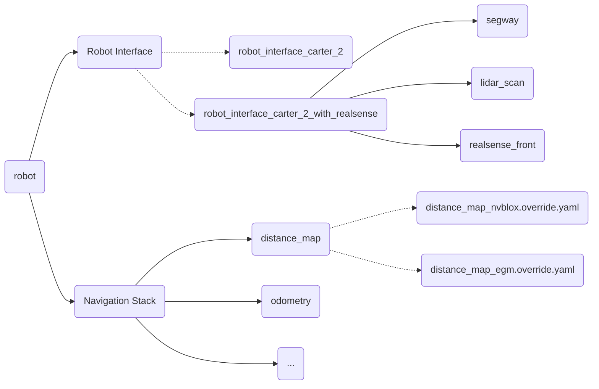

## Basic LiDAR Navigation app
To run the *normal* navigation app, on the host machine:
```bash
./../engine/engine/build/deploy.sh -b bazel -h carter-v23-9.dyn.nvidia.com -d jetpack50 -p <PATH_TO_YOUR_APP>-pkg
```
for example
```bash
./../engine/engine/build/deploy.sh -b bazel -h carter-v23-9.dyn.nvidia.com -d jetpack50 -p //apps/amr/navigation_stack:carter_demo_occupancy_environment_zurich-pkg
```
On the carter:
```bash
cd ~/deploy/<USER>/<APP_YOU_DEPLOYED>
./<PATH_TO_APP_IN_REPO>
```
For example
```bash
cd ~/deploy/alex/carter_demo_occupancy_environment_zurich-pkg/
./apps/amr/navigation_stack/carter_demo_occupancy_environment_zurich
```

## Notes on navigation stack



## Changes I've made
Changes I've made while trying to get nvblox into the navigation stack
* Changed: `robot_interface_carter_2.override.yaml` -> `robot_interface_carter_2_with_realsense.override.yaml`
* Changed: `graphs/single_robot/distance_map_egm.override.yaml` -> `graphs/single_robot/distance_map_nvblox.override.yaml`
* Corrected: ESDF frame parent from `world` to `odom`
* Corrected: mapping frame from `world` to `odom`
* Fixed: Neglected output in the setting of the ESDF frame.


## nvblox + nav-stack Deploy Command
Deploy the navigation stack to the robot
```bash
./../engine/engine/build/deploy.sh -b bazel -h carter-v23-9.dyn.nvidia.com -d jetpack50 -p //apps/amr/navigation_stack:carter_demo_occupancy_nvblox_environment_zurich-pkg
```
