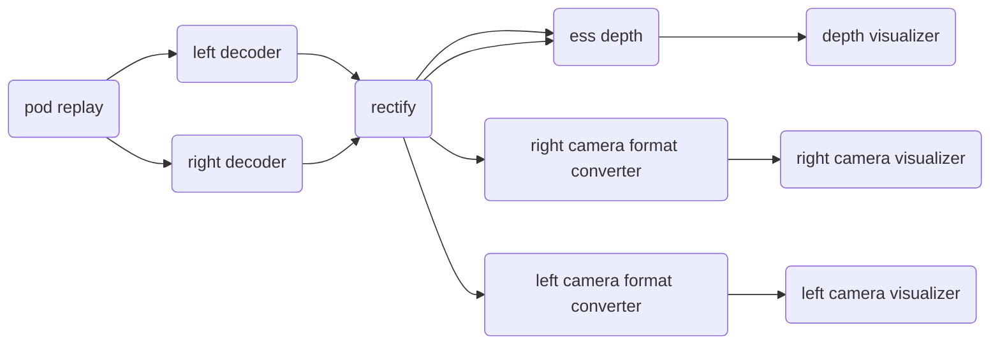

```mermaid
graph LR

id1(pod replay)

id2.1(left decoder)
id2.2(right decoder)

id3(rectify)

id4(ess depth)

id5.1(right camera format converter)
id5.2(left camera format converter)

id6.1(right camera visualizer)
id6.2(left camera visualizer)

id7(depth visualizer)

id1 --> id2.1 & id2.2 --> id3 --> id4
id3 --> id4
id4 --> id7
id3 --> id5.1 --> id6.1
id3 --> id5.2 --> id6.2
```

To play my example
```bash

```